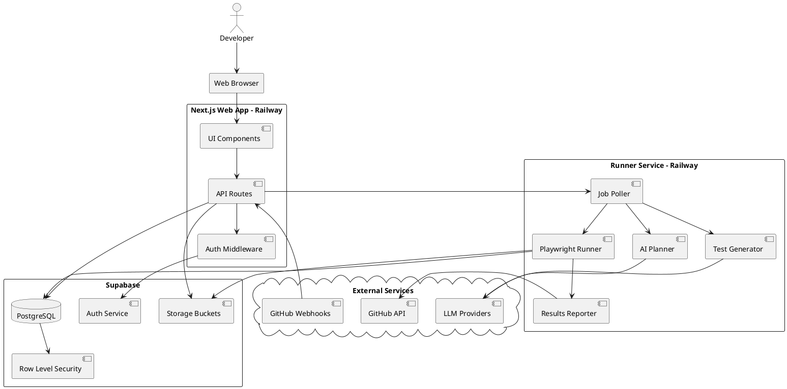
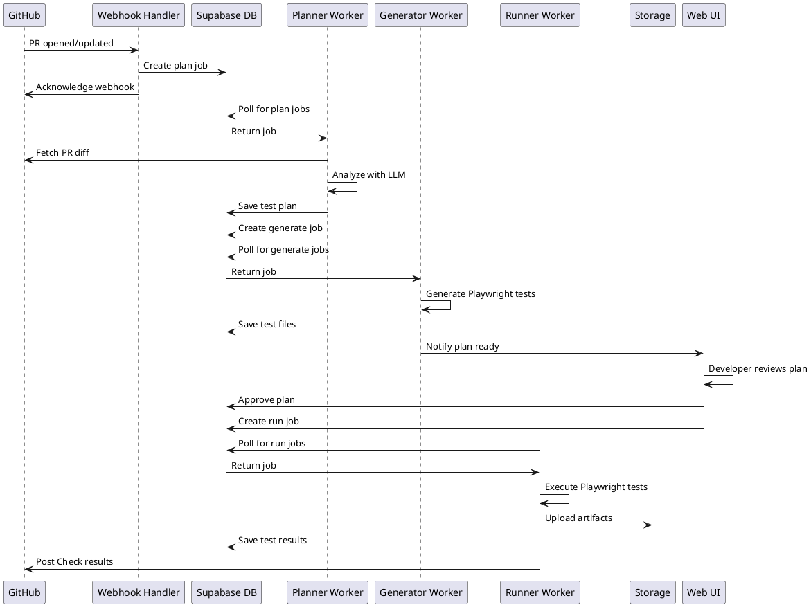
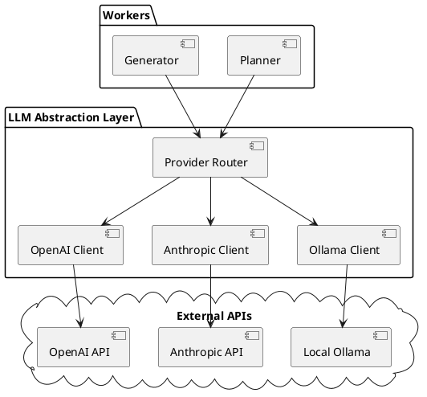
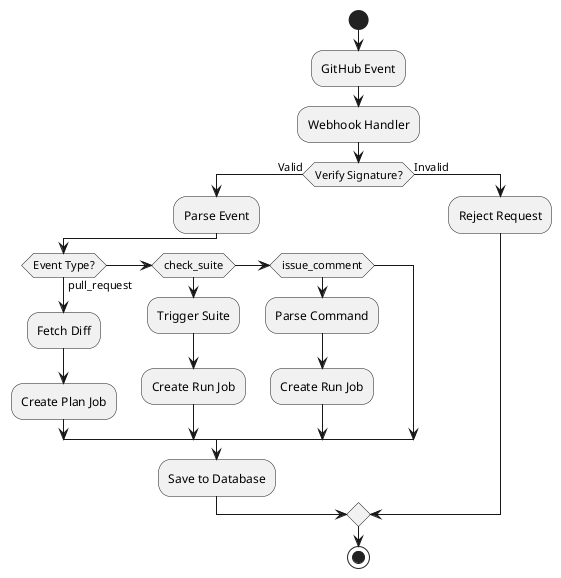

# QAAI Architecture & Implementation Plan

## Overview

QAAI is an AI-driven QA assistant platform that automatically plans, generates, and executes Playwright E2E tests based on PR diffs and specifications. Similar to how Strix works for penetration testing, QAAI provides intelligent test coverage with human-in-the-loop approval.

## System Architecture

### High-Level Component Diagram



### Data Flow: PR to Test Execution



### Multi-LLM Provider Architecture



## Technology Stack

### Frontend
- **Framework**: Next.js 15 with App Router
- **Styling**: Tailwind CSS
- **Language**: JavaScript ESM
- **Package Manager**: pnpm

### Backend
- **API**: Next.js API Routes
- **Database**: Supabase PostgreSQL
- **Auth**: Supabase Auth with RLS
- **Storage**: Supabase Storage
- **Background Jobs**: Custom polling system

### Runner Service
- **Runtime**: Node.js
- **Testing**: Playwright
- **Container**: Docker with Playwright dependencies
- **Deployment**: Railway

### AI/LLM
- **Providers**: OpenAI, Anthropic Claude, Ollama
- **Models**: GPT-4o-mini, Claude Sonnet, Llama 3.1/Qwen
- **Strategy**: Environment-based provider selection

### DevOps
- **Hosting**: Railway for both web and runner
- **CI/CD**: GitHub Actions
- **VCS**: GitHub with App integration

## Project Structure

```
qaai/
├── apps/
│   └── web/                          # Next.js application
│       ├── app/
│       │   ├── layout.js
│       │   ├── page.js               # Dashboard
│       │   ├── projects/
│       │   │   └── [id]/
│       │   │       ├── page.js
│       │   │       └── settings/
│       │   ├── plans/
│       │   │   └── [id]/
│       │   ├── runs/
│       │   │   └── [id]/
│       │   ├── suites/
│       │   │   └── [id]/
│       │   └── api/
│       │       ├── plan/
│       │       ├── generate/
│       │       ├── run/
│       │       ├── artifacts/
│       │       └── webhooks/
│       │           └── github/
│       ├── lib/
│       │   ├── supabase-server.js
│       │   ├── supabase-client.js
│       │   ├── auth.js
│       │   ├── storage.js
│       │   └── github.js
│       ├── components/
│       │   ├── Nav.js
│       │   ├── Table.js
│       │   ├── RunStatusBadge.js
│       │   ├── ArtifactViewer.js
│       │   └── FlakeHeatmap.js
│       └── middleware.js
│
├── services/
│   └── runner/                       # Background worker service
│       ├── index.js                  # Job poller
│       ├── workers/
│       │   ├── planner.js
│       │   ├── generator.js
│       │   ├── runner.js
│       │   └── reporter.js
│       ├── lib/
│       │   ├── llm.js                # Multi-provider LLM client
│       │   ├── jobs.js
│       │   ├── github.js
│       │   └── storage.js
│       ├── playwright.config.js
│       └── Dockerfile
│
├── packages/
│   └── playwright-tests/             # Generated test files
│       └── .gitignore
│
├── infra/
│   ├── supabase/
│   │   ├── schema.sql
│   │   ├── policies.sql
│   │   └── seed.sql
│   ├── railway/
│   │   ├── web.toml
│   │   └── runner.toml
│   └── github/
│       └── workflows/
│           └── ci.yml
│
├── docs/
│   ├── API.md
│   ├── DEPLOYMENT.md
│   └── USER_GUIDE.md
│
├── pnpm-workspace.yaml
├── package.json
├── .env.example
└── README.md
```

## Database Schema

### Core Tables

**organizations** - Multi-tenant organization management
- `id` (uuid, PK)
- `name` (text)
- `created_at` (timestamptz)

**org_members** - Organization membership with roles
- `org_id` (uuid, FK)
- `user_id` (uuid, FK to auth.users)
- `role` (enum: owner, admin, member)

**projects** - Test projects linked to repositories
- `id` (uuid, PK)
- `org_id` (uuid, FK)
- `name` (text)
- `repo_url` (text)
- `app_base_url` (text)
- `env_json` (jsonb)

**suites** - Test suite groupings
- `id` (uuid, PK)
- `project_id` (uuid, FK)
- `name` (text)
- `tags` (text[])

**test_cases** - Individual test definitions
- `id` (uuid, PK)
- `suite_id` (uuid, FK)
- `title` (text)
- `priority` (int)
- `steps` (jsonb)
- `source` (enum: ai, manual)

**plans** - AI-generated test plans from PRs
- `id` (uuid, PK)
- `project_id` (uuid, FK)
- `pr_url` (text)
- `spec_md` (text)
- `plan_json` (jsonb)
- `status` (enum: draft, approved)

**runs** - Test execution runs
- `id` (uuid, PK)
- `project_id` (uuid, FK)
- `plan_id` (uuid, FK)
- `suite_ids` (uuid[])
- `trigger` (enum: manual, pr, schedule, api)
- `status` (enum: queued, running, passed, failed, error)
- `started_at` (timestamptz)
- `finished_at` (timestamptz)

**run_tests** - Individual test results within runs
- `id` (uuid, PK)
- `run_id` (uuid, FK)
- `test_case_id` (uuid)
- `status` (enum: queued, running, passed, failed, flaky, skipped, error)
- `attempt` (int)
- `duration_ms` (int)
- `junit_path` (text)
- `trace_path` (text)
- `video_path` (text)
- `screenshot_path` (text)
- `logs` (text)
- `error_text` (text)

**jobs_queue** - Background job queue
- `id` (bigserial, PK)
- `kind` (enum: plan, generate, run)
- `payload` (jsonb)
- `status` (enum: queued, running, done, error)
- `attempts` (int)
- `last_error` (text)
- `scheduled_at` (timestamptz)
- `locked_by` (text)
- `locked_at` (timestamptz)

### Row Level Security (RLS)

All tables enforce org-scoped access through RLS policies:
- Users can only access data for organizations they're members of
- Policies check `auth.uid()` against `org_members` table
- Service role key bypasses RLS for background workers

## AI Planning & Generation

### Planner Workflow

1. **Input Collection**
   - PR diff (unified format)
   - Repository file tree
   - App base URL
   - Existing test coverage

2. **Analysis**
   - Identify changed routes/components
   - Detect risk areas (auth, payments, forms)
   - Map dependencies
   - Consider edge cases

3. **Plan Generation**
   - Create test scenarios with priorities
   - Define preconditions and data needs
   - Specify assertions and expected outcomes
   - Output structured JSON

### Generator Workflow

1. **Input**: Test plan JSON from planner
2. **Processing**:
   - Convert scenarios to Playwright test syntax
   - Add appropriate selectors (prefer data-testid)
   - Include retry logic and timeouts
   - Add tags for categorization
3. **Output**: Executable `.spec.js` files

### LLM Provider Abstraction

```javascript
// lib/llm.js
export class LLMClient {
  constructor() {
    this.provider = process.env.LLM_PROVIDER || 'openai';
  }
  
  async complete(prompt, options = {}) {
    switch (this.provider) {
      case 'openai':
        return this.openaiComplete(prompt, options);
      case 'anthropic':
        return this.anthropicComplete(prompt, options);
      case 'ollama':
        return this.ollamaComplete(prompt, options);
      default:
        throw new Error(`Unknown provider: ${this.provider}`);
    }
  }
}
```

## Playwright Test Execution

### Test Harness Features

- **Headless Chromium** execution
- **Automatic retries** (1 retry on failure)
- **Trace capture** on first retry
- **Video recording** on failure
- **Screenshot capture** at key points
- **HAR file** generation for network analysis
- **Deterministic data seeding** before each test
- **Login helpers** for authenticated flows

### Artifact Management

All test artifacts stored in Supabase Storage:
- Path format: `/org/{orgId}/project/{projectId}/run/{runId}/test/{testId}/`
- Artifacts: `trace.zip`, `video.webm`, `screenshots/*.png`, `test.har`
- Access via signed URLs (1-hour expiry)
- Automatic cleanup after 30 days

## GitHub Integration

### GitHub App Setup

1. Create GitHub App with permissions:
   - Repository: Read & Write (for Checks API)
   - Pull Requests: Read
   - Webhooks: Active

2. Subscribe to events:
   - `pull_request` (opened, synchronize)
   - `check_suite` (requested)
   - `issue_comment` (for `/qa-run` commands)

### Webhook Flow



### Check Runs

Reporter posts GitHub Check with:
- Summary of pass/fail counts
- Annotations for failing tests (file/line from stack trace)
- Links to artifact viewer in QAAI dashboard
- Duration and flake indicators

## Flake Detection

### Algorithm

```javascript
// Detect flaky tests
function detectFlakes(testCaseId, windowSize = 10) {
  const recentRuns = getRecentRuns(testCaseId, windowSize);
  const passed = recentRuns.filter(r => r.status === 'passed').length;
  const failed = recentRuns.filter(r => r.status === 'failed').length;
  
  // Flaky if both passes and failures exist
  if (passed > 0 && failed > 0) {
    const flakeRate = failed / recentRuns.length;
    return { isFlaky: true, flakeRate };
  }
  
  return { isFlaky: false, flakeRate: 0 };
}
```

### Heatmap Visualization

- X-axis: Routes/components
- Y-axis: Test cases
- Color intensity: Flake rate (0-100%)
- Hover: Show recent run history
- Click: Navigate to test details

## Security Considerations

### Authentication & Authorization

- Supabase Auth with email/password and OAuth
- JWT tokens for API authentication
- RLS policies enforce org-scoped data access
- Service role key only on server-side and runner

### Secrets Management

- Environment variables for API keys
- Supabase Vault for sensitive project configs
- GitHub App private key stored as base64
- No secrets in client-side code

### Storage Security

- Private buckets with signed URLs
- 1-hour URL expiry
- Path-based access control
- Automatic artifact cleanup

## Performance Optimization

### Database

- Indexes on foreign keys and frequently queried columns
- Materialized views for dashboard metrics
- Connection pooling via Supabase
- Prepared statements for common queries

### Runner Service

- Concurrent job processing (configurable)
- Job locking to prevent duplicate execution
- Exponential backoff on failures
- Resource limits per container

### Frontend

- Server-side rendering for initial load
- Client-side caching with SWR
- Lazy loading for artifact viewers
- Optimistic UI updates

## Monitoring & Observability

### Metrics to Track

- Job queue depth and processing time
- Test execution duration trends
- Flake rate over time
- API response times
- Storage usage

### Logging

- Structured JSON logs
- Log levels: debug, info, warn, error
- Correlation IDs for request tracing
- Railway log aggregation

## Development Workflow

### Local Setup

```bash
# Install dependencies
pnpm install

# Set up environment
cp .env.example .env
# Edit .env with your Supabase and API keys

# Run database migrations
pnpm db:migrate

# Start development servers
pnpm dev:web      # Next.js on :3000
pnpm dev:runner   # Runner service
```

### Testing Strategy

- Unit tests for utilities and helpers
- Integration tests for API routes
- E2E tests for critical user flows
- Mock LLM responses in tests
- Test database seeding scripts

## Deployment

### Railway Configuration

**Web Service** (`railway.toml`):
```toml
[build]
builder = "NIXPACKS"

[deploy]
startCommand = "pnpm --filter apps/web start"
healthcheckPath = "/api/health"
```

**Runner Service** (`services/runner/railway.toml`):
```toml
[build]
builder = "DOCKERFILE"
dockerfilePath = "services/runner/Dockerfile"

[deploy]
startCommand = "node index.js"
```

### Environment Variables

See `.env.example` for complete list. Key variables:
- `NEXT_PUBLIC_SUPABASE_URL`
- `SUPABASE_SERVICE_ROLE_KEY`
- `LLM_PROVIDER` (openai/anthropic/ollama)
- `GITHUB_APP_ID`
- `RUNNER_CONCURRENCY`

## Implementation Phases

### Phase 1: Foundation (Skeleton)
- Project structure and dependencies
- Next.js app with Tailwind
- Supabase setup and schema
- Basic auth and RLS
- Storage buckets

### Phase 2: Runner Infrastructure
- Job polling system
- Playwright configuration
- Basic test execution
- Artifact upload
- Result recording

### Phase 3: AI Planning & Generation
- Multi-LLM client
- Planner worker
- Generator worker
- Plan approval UI
- Test file management

### Phase 4: GitHub Integration
- GitHub App setup
- Webhook handler
- PR diff analysis
- Check runs reporter
- Comment commands

### Phase 5: Flake Detection & Coverage
- Flake detection algorithm
- Heatmap visualization
- Coverage tracking
- Analytics dashboard

### Phase 6: Polish & Production
- Seed data strategy
- Login helpers
- Retry configuration
- Org management
- Documentation
- CI/CD pipeline

## Success Metrics

- **Test Generation**: AI successfully generates valid Playwright tests from 90%+ of PRs
- **Execution Stability**: <5% flake rate on non-flaky tests
- **Performance**: Test runs complete within 5 minutes for typical PR
- **Coverage**: 80%+ route coverage for integrated projects
- **User Adoption**: Developers approve and commit 70%+ of AI-generated tests

## Future Enhancements

- Visual regression testing with golden screenshots
- Component-level testing via Storybook integration
- Temporal or BullMQ for advanced job orchestration
- Multi-browser support (Firefox, Safari)
- Performance testing and benchmarking
- API contract testing
- Accessibility testing integration