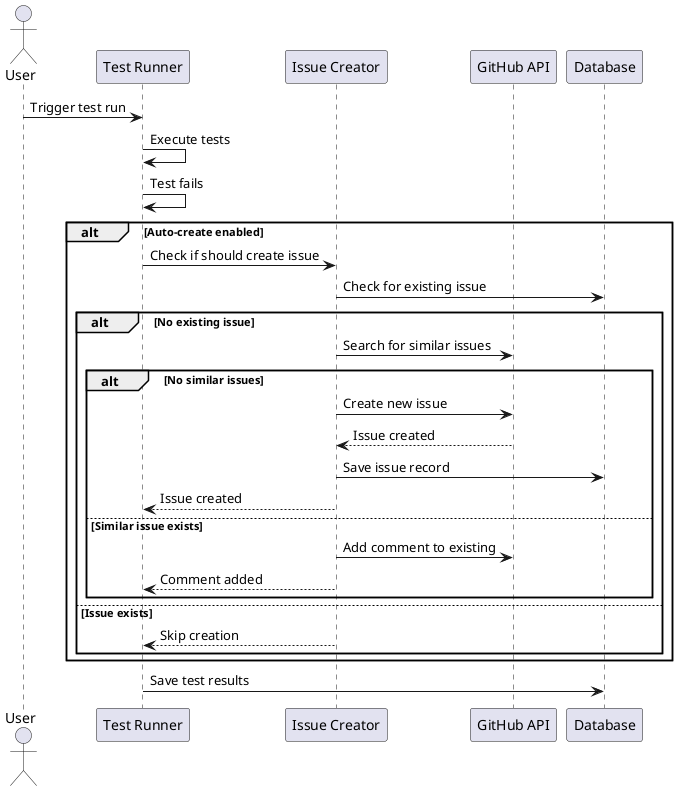
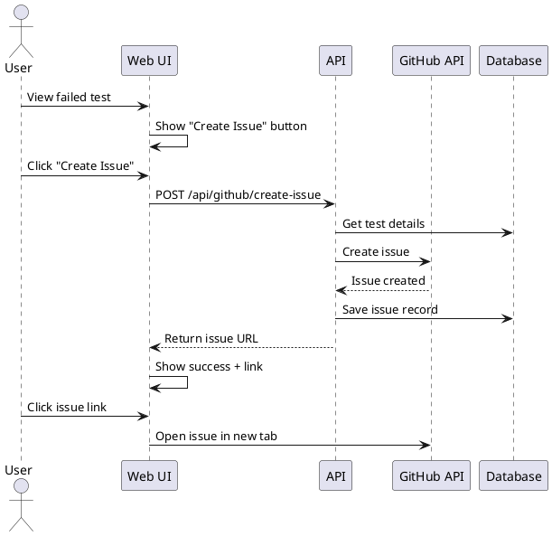

# GitHub Issue Integration Feature

## Overview

This feature allows QAAI to automatically create GitHub issues for test failures discovered during QA runs. Users can configure this behavior per project and manually create issues from the UI.

## Feature Requirements

### 1. Automatic Issue Creation (Optional)
- When a test fails, optionally create a GitHub issue in the connected repository
- Configurable per project (on/off toggle)
- Only create issues for new failures (not for known flaky tests)
- Avoid duplicate issues for the same failure

### 2. Manual Issue Creation
- Button in test results UI to manually create GitHub issue
- Pre-filled with test failure details
- Allow editing before submission
- Link created issue back to test result

### 3. Issue Content
Issues should include:
- Test name and description
- Failure reason and error message
- Link to QAAI test result with artifacts
- Steps to reproduce
- Environment information
- Labels (e.g., `qa-automated`, `bug`, `needs-triage`)

## Architecture Changes

### Database Schema Updates

Add to `infra/supabase/schema.sql`:

```sql
-- GitHub issue tracking
create table github_issues (
  id uuid primary key default gen_random_uuid(),
  run_test_id uuid references run_tests(id) on delete cascade,
  project_id uuid references projects(id) on delete cascade,
  issue_number int not null,
  issue_url text not null,
  issue_title text not null,
  created_by uuid,
  created_at timestamptz default now()
);

-- Project GitHub settings
alter table projects add column if not exists github_installation_id bigint;
alter table projects add column if not exists github_repo_owner text;
alter table projects add column if not exists github_repo_name text;
alter table projects add column if not exists auto_create_issues boolean default false;
alter table projects add column if not exists issue_labels text[] default array['qa-automated', 'bug'];

-- Index for issue lookups
create index idx_github_issues_run_test on github_issues(run_test_id);
create index idx_github_issues_project on github_issues(project_id);
```

### GitHub App Permissions

Update GitHub App to include:
- **Issues**: Read & Write
- **Repository contents**: Read (for file references)

### API Routes

#### POST /api/github/create-issue
Create a GitHub issue from a test failure

**Request:**
```json
{
  "runTestId": "uuid",
  "title": "Test failure: User login flow",
  "body": "Custom description...",
  "labels": ["qa-automated", "bug", "high-priority"]
}
```

**Response:**
```json
{
  "issueNumber": 123,
  "issueUrl": "https://github.com/owner/repo/issues/123",
  "created": true
}
```

#### GET /api/github/check-duplicate
Check if an issue already exists for this failure

**Query params:**
- `runTestId`: UUID of the test result
- `testCaseId`: UUID of the test case

**Response:**
```json
{
  "exists": true,
  "issueNumber": 123,
  "issueUrl": "https://github.com/owner/repo/issues/123"
}
```

## Implementation Details

### 1. GitHub Client Enhancement

Update `apps/web/lib/github.js`:

```javascript
import { Octokit } from '@octokit/rest';
import { createAppAuth } from '@octokit/auth-app';

export class GitHubClient {
  constructor(installationId) {
    this.octokit = new Octokit({
      authStrategy: createAppAuth,
      auth: {
        appId: process.env.GITHUB_APP_ID,
        privateKey: Buffer.from(
          process.env.GITHUB_APP_PRIVATE_KEY_B64,
          'base64'
        ).toString('utf-8'),
        installationId,
      },
    });
  }

  async createIssue({ owner, repo, title, body, labels }) {
    const { data } = await this.octokit.issues.create({
      owner,
      repo,
      title,
      body,
      labels,
    });
    
    return {
      number: data.number,
      url: data.html_url,
    };
  }

  async searchIssues({ owner, repo, query }) {
    const { data } = await this.octokit.search.issuesAndPullRequests({
      q: `repo:${owner}/${repo} ${query} is:issue`,
    });
    
    return data.items;
  }

  async addComment({ owner, repo, issueNumber, body }) {
    await this.octokit.issues.createComment({
      owner,
      repo,
      issue_number: issueNumber,
      body,
    });
  }
}
```

### 2. Issue Template Generator

Create `apps/web/lib/issue-template.js`:

```javascript
export function generateIssueBody({
  testName,
  errorMessage,
  stackTrace,
  testResultUrl,
  environment,
  runMeta,
}) {
  return `## Test Failure Report

**Test Name:** ${testName}

**Error Message:**
\`\`\`
${errorMessage}
\`\`\`

**Stack Trace:**
\`\`\`
${stackTrace?.slice(0, 1000) || 'N/A'}
\`\`\`

**Environment:**
- Browser: ${environment.browser || 'Chromium'}
- Base URL: ${environment.baseUrl}
- Playwright Version: ${runMeta.playwrightVersion}

**Artifacts:**
- [View full test results and artifacts](${testResultUrl})

**Steps to Reproduce:**
1. Run the test: \`${testName}\`
2. Observe the failure

---
*This issue was automatically created by QAAI*
`;
}

export function generateIssueTitle(testName, errorType) {
  return `[QA] ${testName} - ${errorType}`;
}
```

### 3. Automatic Issue Creation Logic

Create `services/runner/lib/issue-creator.js`:

```javascript
import { createClient } from '@supabase/supabase-js';
import { GitHubClient } from './github.js';

const supabase = createClient(
  process.env.SUPABASE_URL,
  process.env.SUPABASE_SERVICE_ROLE_KEY
);

export async function maybeCreateIssue(runTest, project) {
  // Skip if auto-create is disabled
  if (!project.auto_create_issues) {
    return null;
  }

  // Skip if test passed or is flaky
  if (runTest.status !== 'failed') {
    return null;
  }

  // Check if issue already exists
  const { data: existingIssue } = await supabase
    .from('github_issues')
    .select('*')
    .eq('run_test_id', runTest.id)
    .single();

  if (existingIssue) {
    return existingIssue;
  }

  // Check for similar recent issues
  const github = new GitHubClient(project.github_installation_id);
  const searchQuery = `"${runTest.test_case_id}" label:qa-automated`;
  const existingIssues = await github.searchIssues({
    owner: project.github_repo_owner,
    repo: project.github_repo_name,
    query: searchQuery,
  });

  if (existingIssues.length > 0) {
    // Add comment to existing issue instead
    await github.addComment({
      owner: project.github_repo_owner,
      repo: project.github_repo_name,
      issueNumber: existingIssues[0].number,
      body: `This test failed again in run ${runTest.run_id}`,
    });
    return null;
  }

  // Create new issue
  const issueBody = generateIssueBody({
    testName: runTest.title,
    errorMessage: runTest.error_text,
    stackTrace: runTest.logs,
    testResultUrl: `${process.env.APP_URL}/runs/${runTest.run_id}/tests/${runTest.id}`,
    environment: project.env_json,
    runMeta: {},
  });

  const issue = await github.createIssue({
    owner: project.github_repo_owner,
    repo: project.github_repo_name,
    title: generateIssueTitle(runTest.title, 'Test Failure'),
    body: issueBody,
    labels: project.issue_labels || ['qa-automated', 'bug'],
  });

  // Save to database
  const { data } = await supabase
    .from('github_issues')
    .insert({
      run_test_id: runTest.id,
      project_id: project.id,
      issue_number: issue.number,
      issue_url: issue.url,
      issue_title: generateIssueTitle(runTest.title, 'Test Failure'),
    })
    .select()
    .single();

  return data;
}
```

### 4. UI Components

#### Issue Creation Button

Create `apps/web/components/CreateIssueButton.js`:

```javascript
'use client';

import { useState } from 'react';

export default function CreateIssueButton({ runTestId, testName, error }) {
  const [loading, setLoading] = useState(false);
  const [issueUrl, setIssueUrl] = useState(null);

  const handleCreateIssue = async () => {
    setLoading(true);
    
    try {
      const response = await fetch('/api/github/create-issue', {
        method: 'POST',
        headers: { 'Content-Type': 'application/json' },
        body: JSON.stringify({
          runTestId,
          title: `[QA] ${testName} - Test Failure`,
          labels: ['qa-automated', 'bug'],
        }),
      });

      const data = await response.json();
      setIssueUrl(data.issueUrl);
    } catch (error) {
      console.error('Failed to create issue:', error);
      alert('Failed to create GitHub issue');
    } finally {
      setLoading(false);
    }
  };

  if (issueUrl) {
    return (
      <a
        href={issueUrl}
        target="_blank"
        rel="noopener noreferrer"
        className="inline-flex items-center px-4 py-2 border border-gray-300 rounded-md shadow-sm text-sm font-medium text-gray-700 bg-white hover:bg-gray-50"
      >
        View Issue #{issueUrl.split('/').pop()}
      </a>
    );
  }

  return (
    <button
      onClick={handleCreateIssue}
      disabled={loading}
      className="inline-flex items-center px-4 py-2 border border-transparent rounded-md shadow-sm text-sm font-medium text-white bg-blue-600 hover:bg-blue-700 disabled:opacity-50"
    >
      {loading ? 'Creating...' : 'Create GitHub Issue'}
    </button>
  );
}
```

#### Project Settings for GitHub

Add to `apps/web/app/projects/[id]/settings/page.js`:

```javascript
<div className="space-y-4">
  <h3 className="text-lg font-medium">GitHub Integration</h3>
  
  <div>
    <label className="flex items-center">
      <input
        type="checkbox"
        checked={autoCreateIssues}
        onChange={(e) => setAutoCreateIssues(e.target.checked)}
        className="rounded border-gray-300"
      />
      <span className="ml-2">Automatically create issues for test failures</span>
    </label>
  </div>
  
  <div>
    <label className="block text-sm font-medium text-gray-700">
      Issue Labels
    </label>
    <input
      type="text"
      value={issueLabels.join(', ')}
      onChange={(e) => setIssueLabels(e.target.value.split(',').map(l => l.trim()))}
      placeholder="qa-automated, bug, needs-triage"
      className="mt-1 block w-full rounded-md border-gray-300 shadow-sm"
    />
  </div>
</div>
```

## User Flow

### Automatic Issue Creation Flow



### Manual Issue Creation Flow



## Configuration

### Environment Variables

Add to `.env.example`:

```env
# GitHub App (existing)
GITHUB_APP_ID=
GITHUB_APP_PRIVATE_KEY_B64=

# App URL for issue links
APP_URL=https://qaai.yourdomain.com
```

### Project Settings

Users configure per project:
- **Auto-create issues**: Toggle on/off
- **Issue labels**: Comma-separated list
- **GitHub repository**: Owner/repo (auto-detected from repo_url)

## Testing Strategy

### Unit Tests
- Issue template generation
- Duplicate detection logic
- Label parsing

### Integration Tests
- GitHub API mocking
- Issue creation flow
- Database operations

### E2E Tests
- Manual issue creation from UI
- Auto-create on test failure
- Duplicate prevention

## Security Considerations

1. **GitHub App Permissions**: Minimal scope (issues only)
2. **Rate Limiting**: Respect GitHub API limits (5000/hour)
3. **Authentication**: Verify user has access to project
4. **Sensitive Data**: Don't include secrets in issue body

## Future Enhancements

- **Issue Templates**: Custom templates per project
- **Auto-close**: Close issues when tests pass
- **Assignees**: Auto-assign based on code ownership
- **Milestones**: Link to project milestones
- **Projects**: Add to GitHub Projects board
- **Notifications**: Slack/Discord integration
- **Batch Creation**: Create multiple issues at once

## Success Metrics

- Number of issues created automatically
- Number of issues created manually
- Duplicate prevention rate
- Time saved vs manual issue creation
- User adoption rate of the feature